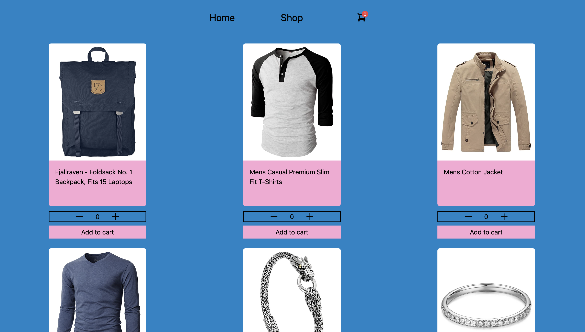
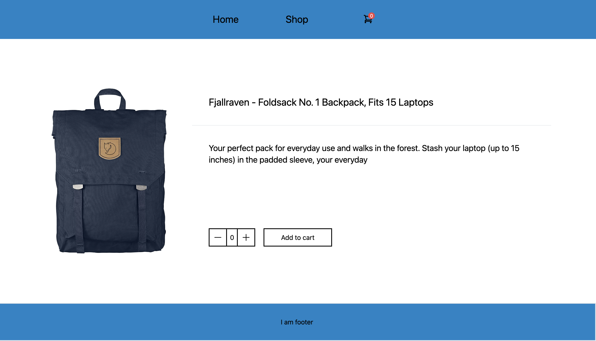
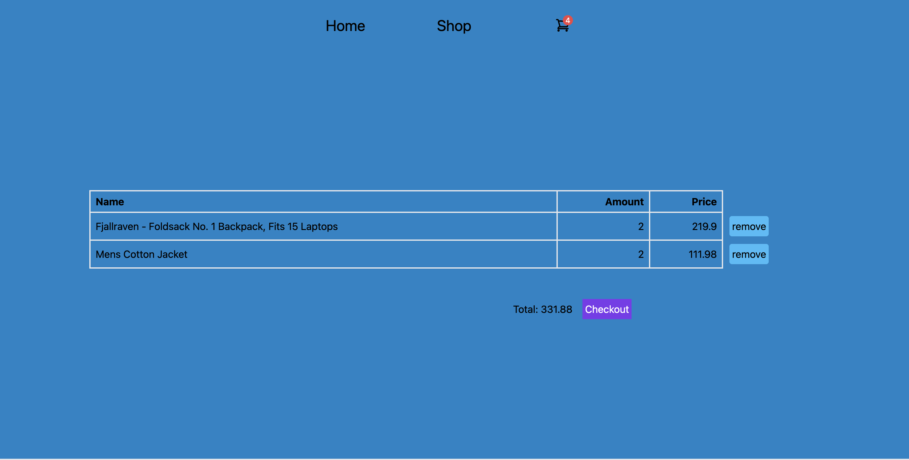

Welcom to my a mock shopping cart! 

This is a project from theodinproject.com [https://www.theodinproject.com/lessons/node-path-react-new-shopping-cart]

In this project, i practiced a bunch of new skills all based around React. 

The tools i have used: 
- React as the main UI library
- react-router to create a SPA
- vitest and react-testing-library for unit testing
- Mock Service Worker for intercepting requests and mocking responses
- propTypes for type checking 

preview: 
  

The design is very raw, but i may revisit this app when i will create my portfolio. 
It was a lot of fun. I had the most trouble with proper testing, but at the end i managed to resolve them. 
More in debth overview of problems i stumbled upon can be found below.

TO DO:
- Finish constructing layout (Cart.jsx) with fake data         *DONE*
- Find all the states of the app and where they live           *DONE*
- fetch the data from external api                             *DONE*
- implement the different states and pass the props            *DONE*
 # Add the remove from cart function in cart.jsx               *DONE*
- add propTypes                                                *DONE*
- test                                                         *DONE*
- create an error page                                         *DONE*
- finish styling                                               *DONE*     

TO DO WHEN REVISIT: 
- Improve design
- Add localStorage
- Find an API with more concise products? (like bestbuy for example)
- Add search by category 
- Enabling removing from cart specific amount of items
- Create a search option and a search bar?

to fix: 
- Fix amount showing more then 2 numbers after 0

Layout creation: 
- So i tried for the first time to use tailwind in my project. I really liked how fast you can prototype
the layout. 
- What i didn't liked was how difficult it is to debug it. you just have a forest of html tags, with no meaningful names, especially when it is just a container. To find the one with the rules i wanted to change was very difficult.
- Which leads me to my main epiphany: DON'T USE FIXED WIDTH AND HEIGHT (or max/min sizes) UNLESS YOU HAVE TO.
and certainly not for creating the first layout. It was super difficult to debug the ItemCard.jsx for me, because of that, at the end i had to rewrite all the stylings from scratch, because i could't figure out which rules break the layout. When i re-wrote it without fixed sizes, it went really smoothly. At the end i used fixed sizes for the desktop layout implementation. Whenever you can, use `padding` and `margin` instead, as they are fully responsive.

Testing: 
- One of the first issues i encountered, is that i cannot use any network requests (like `fetch`)
in vitest (At the beginning i didn't understand that it was due to the fact vitest run in node, so i freaked out like hell). After some research and going through other people submission, i found out about `mswjs`, and thus this is what i will try to implement. As for now, when i try to test the App.jsx component to check if 'I am Home' heading is present, i receive an error and the default react router error page is rendered
- Another question i want to tackle, is how to pass mock data to the outlet element of react router
- And also i want to understand how to use MemoryRouter, and how to test an app build with React Router

- So at the end, i learned to use `mswjs` to intercept network requests and mock responses. It was quite complicated to me (i think it is because i don't really understand how requests and servers work)
- But i managed to implement it in my unit tests. I run into a lot of issues, particularly when testing confitional rendering based on state changing right after the fetch request.
- But now it works! I really learned a lot. I have an impression, that mocking libraries and external API's is a really great way to get a better understanding of those tools.